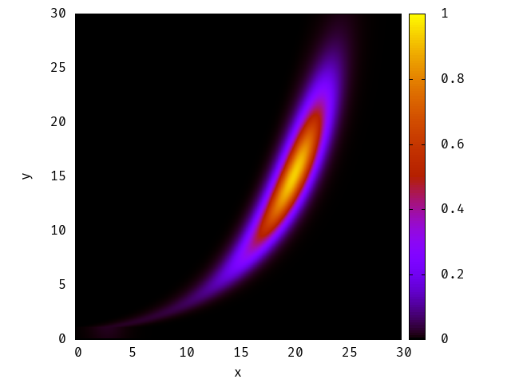
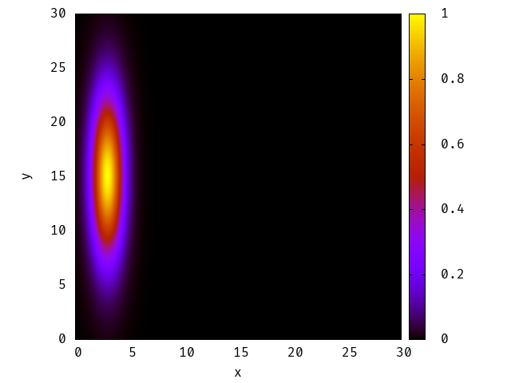
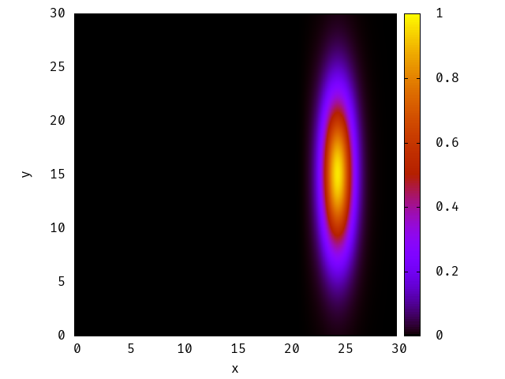
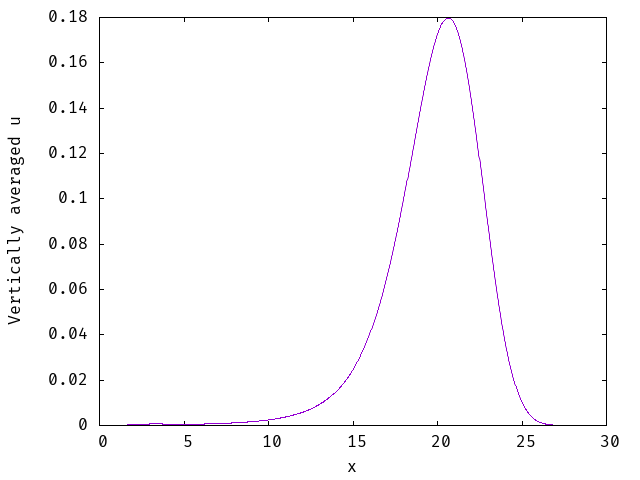

# 2D Advection Solver (C + OpenMP)

A finite-difference solver for the 2D advection equation, parallelised with OpenMP.
It transports a Gaussian pulse through a vertically sheared, log-law wind profile,
like wind near the ground in an atmospheric boundary layer.

> Built for the **ECM3446 High Performance Computing** module at the University of Exeter
> (individual coursework, 2026). The module supplied a serial starter program. The OpenMP
> parallelisation, the shear-flow model and the vertical-averaging analysis are my work.



## What it does

- Solves `∂u/∂t + v_x(y) ∂u/∂x + v_y ∂u/∂y = 0` on a 1000 × 1000 grid with first-order
  upwind differences and explicit time stepping
- Picks the time step from the CFL condition (CFL = 0.9)
- Wind speed follows the log law `v_x(y) = (u*/κ) ln(y/z0)` above the roughness length,
  so the pulse shears as it moves
- Parallelises initialisation, boundary updates and the time-step loops with OpenMP. A
  single parallel region wraps the whole time loop to avoid re-spawning threads every step.
- Writes the initial field, the final field and the vertically averaged profile to `.dat`
  files for plotting with gnuplot

## Build and run

```bash
gcc -fopenmp -O2 -std=c99 -o advection2D advection2D.c -lm
OMP_NUM_THREADS=8 ./advection2D
gnuplot plot_final.txt     # final.dat to final.png
gnuplot plot_uavg.txt      # u_vertavg.dat to a profile plot
```

## Results

| Initial condition | Final state | Vertically averaged *u* |
|---|---|---|
|  |  |  |
